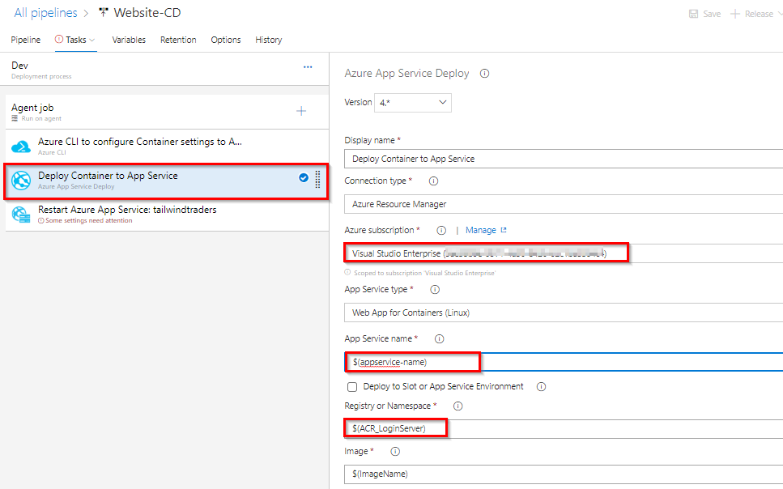

# Integrating GitHub with Azure Pipelines

## Key Takeaway

The key takeaways from this demo are: 

1. **DevOps** unifies people, process and technology, automates software releases for delivering continuous value to the users. 

1. **Azure Pipelines** can automatically build and validate every pull request and commit to your GitHub repository.

## Before you begin

You require the following to follow the demo.

1. A GitHub account from https://github.com.

1. An Azure account from https://azure.com.

1. An Azure DevOps account from https://dev.azure.com.

1. Provision the **Tailwind Traders** project to your Azure DevOps organization with the <a href="https://azuredevopsdemogenerator-staging.azurewebsites.net/?name=tailwind%20traders">Azure DevOps Demo Generator</a>.

## Task 1: Forking a GitHub repository

1. Navigate to https://github.com/Microsoft/TailwindTraders-Website. This is the baseline project that we will fork and use in this task.

1. Sign in to your GitHub account and click **Fork** to fork the repository to your own account. If prompted, select an account to fork the repository into.

    

## Task 2: Installing Azure Pipelines and configuring CI pipeline

1. The GitHub Marketplace provides a variety of tools from Microsoft and 3rd parties that help you extend your project workflows. Click Marketplace from the top navigation to visit it.

    

1. Search for **Azure Pipelines** and select the result.

    

1. Take a moment to read about the benefits of Azure Pipelines by clicking **Read more**.

    
    

1. The Azure Pipelines offers unlimited build minutes with 10 free parallel jobs for public repositories, and 1800 build minutes per month with 1 parallel job if you’re using a private repository. Click **Install it for free** under *Pricing and Setup* towards the bottom of the page.

    

1. If you have multiple GitHub accounts, select the one you forked the Website to from the **Switch billing account** dropdown.

    

1. Click **Complete order and begin installation**.

    

1. You have the option to specify repositories to include, but for the purposes of this demo, just include all of them. Note that Azure DevOps requires the listed set of permissions to fulfill its services. Click **Install**.

    

1. You may be prompted to confirm your GitHub password to continue and also be prompted to log in to your Microsoft account. Make sure you’re logged into the one associated with your Azure DevOps account. Next, you may need to choose the Azure DevOps account and project for which Azure Pipelines need access.

    

1. You will be directed to the **New pipeline** page of the chosen Azure DevOps project.

    

1. The Azure DevOps Demo Generator which has provisioned the project for you, has also created a build and a release pipeline. Let us use those pipelines to configure and queue the pipelines.

1. Navigate to **Pipelines –> Builds**. Select **Website-CI** and click **Edit**.

    

1. Your build pipeline will look like below. With this pipeline we are creating following Azure resources for the application deployment.
    
      - Azure Container Registry
      - Web App for Containers

    Then we will build the application Docker image and push the image to ACR provisioned.

   

1. In the **Tasks**, choose **Get sources --> GitHub**. 

    

1. Click the ellipsis **...** button under *Repository* and choose the forked GitHub repository.

    

    

1. Select [Azure Resource Group Deployment](https://github.com/Microsoft/azure-pipelines-tasks/blob/master/Tasks/AzureResourceGroupDeploymentV2/README.md) task.
This task is used to create or update a resource group in Azure using the [Azure Resource Manager templates](https://azure.microsoft.com/en-in/documentation/articles/resource-group-template-deploy/). To deploy to Azure, an Azure subscription has to be linked to Azure Pipelines. Select your **Azure subscription** from Azure subscription dropdown. Click **Authorize**. If your subscription is not listed or to specify an existing service principal, follow the [Service Principal creation](https://docs.microsoft.com/en-us/azure/devops/pipelines/library/connect-to-azure?view=vsts) instructions.

    

1. Select [ARM Outputs](https://github.com/keesschollaart81/vsts-arm-outputs) task.  This task enables you to use the ARM Deployment outputs in your Azure Pipelines. Select your **Azure subscription** from Azure subscription dropdown.

   

1. Select **Build an Image** task. Here we are using [Docker task](https://docs.microsoft.com/en-us/azure/devops/pipelines/tasks/build/docker?view=vsts) to build and push application image. Select your **Azure subscription** from Azure subscription dropdown and do the same for **Push image** task as well.

    

1. Select **Variables**. In this section, we have defined Azure resource group name, location and other required parameters for the build pipeline as variables.

      

1. Now **Save** the changes and **Queue** the build. All the tasks in the pipeline will be executed sequentially and you can see the progress of the build in the live console.
  
    

1. Once the build is success go to your Azure portal and navigate to resource group **TailwindTraderWeb**. You should be able to see the following resources which were deployed during the build.

   

   And you should be able to see repository with name **website** in your Container registry.
  
   

## Configure Build(CD) pipeline for Website

1. Navigate to **Pipeline » Releases**. Select **Website-CD** and click **Edit** pipeline.
   
    

1. Select **Dev** stage and click **View stage tasks** to view the pipeline tasks.

    

    You will see the tasks as below.

    

1. Select **Variables**. You need to enter your ACR and App service (which are provisioned in build pipeline) details here. We will make use of these variable values in our pipeline tasks.
   
    

   To get the details navigate to the Azure resource group provisioned earlier.
   Make a note of App service name

    

   Navigate to ACR and select **Access keys**. Make a note of the following details

   

   Enter the above values for the appropriate variables.

1. Select  **Azure CLI** task. Here we are using Azure CLI script to set the container settings for the Azure app service we created. Select the **Azure service connection** from the drop down. 
 
    

1. Select **App Service** task. Make sure you have selected **Azure service connection** and **App service name**.
     
     

1. Select **[Azure App Service manage](https://github.com/Microsoft/azure-pipelines-tasks/blob/master/Tasks/AzureAppServiceManageV0/README.md)** task. Select the required parameters as shown below. We are using this task here to restart the app service.
 
   

1. **Save** the changes and queue the release.

    

1. Once the release is success navigate to your Azure portal. Select the app service that we created and browse to view the application deployed.

   

   

